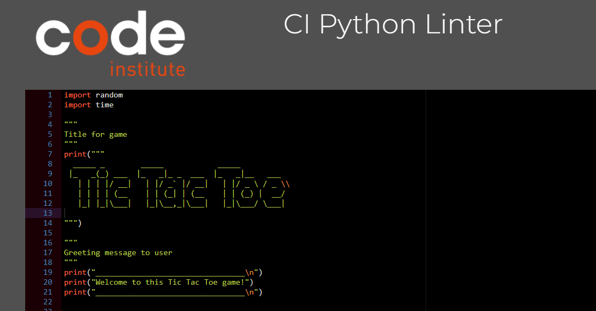
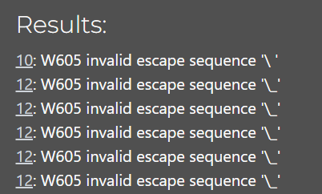
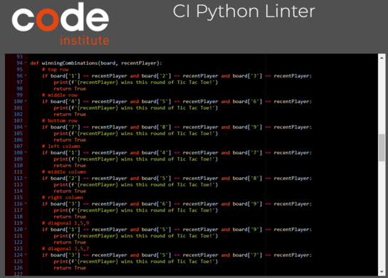
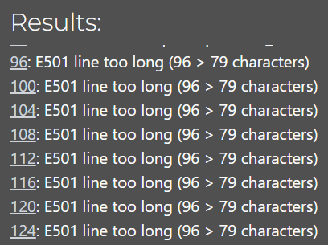
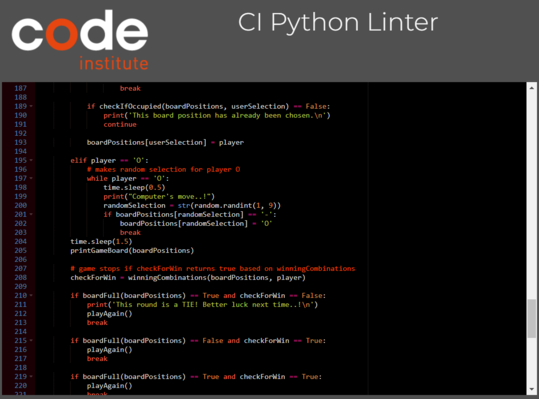
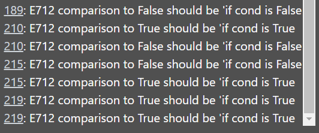

# PORTFOLIO PROJECT 3

# Tic Tac Toe

Tic Tac Toe is a game in which two players take turns in drawing either an 'O' or an 'X' in one square of a grid
consisting of nine squares. The winner is the first player to get three of the same symbols in a row.
This can be up, down, across or diagonally.
If neither player gets three symbols into a row but the game board is full, the game ends in a tie.
In this game the user is player X and plays against a computer, player O.

 [Am I Responsive](https://amiresponsive.co.uk/)

#

## PROJECT IDEA

My initial idea for this project was to build a simple and easy to undertsnad Tic Tac Toe game that the user can play against a computer.

The features I wanted the game to have are:

- Game navigations and controls are easy to understand
- Name input to make the experience more personal
- Rules explained so they are easy to follow
- Game gives feedback dependig on user input
- Computer opponent which the user plays against

#

## Flowchart

#

## UX/UI

- The game is simple to understand and fun for users of different age groups
- The game is explained so the user can play the game without any troubles
- The game has been designed so it is easy to play

#

## USER STORIES

1. As a user, I want to be able to add my name to the game
2. As a user, I want to be able decide where to place my symbol
3. As a user, I want to be able to have a visual output of the game
4. As a user, I want to be able to see the computer's choices on the game board
5. As a user, I want to be able to see who has won the game
6. As a user, I want to be able to play the game again once the game is complete

#

## FEATURES

The game has got following features:
### Header

* The game has a header which was made in an ASCII generator

### Name Prompt

* The user gets prompted to input their name so the programme can use it throughout the game

### Game Rules

* After inputting a name, the programme displays the game rules
* These are programmed to pop up bit by bit to make sure the user reads them thoroughly

### User Input

* Afther the rules have been displayed the user is asked to input their game field selection

### Computer

* The computer is the user's opponent and randomly selects available game fields

### Game Board

* The programme prints a game board after every input to make the available fields and previous selections visible to the user

### Play Again Option

* The user gets the option to play again after the game has finished

### Goodbye Message

* If the user decides they do not want to play another round, a Goodbye message is displayed

## Future Feature

* An idea for a future feature would be to let the user decide if they want to play against a computer or let Player O be a friend instead and turn the game into a 2 player game on selection

#

# TESTING

## User story testing

1. As a user, I want to be able to add my name to the game

 | **Feature** | **Action** | **Expected Result** | **Actual Result** |
 | ------------- | ------------ | --------------------- | ------------------- |
 | Enter  username | Input username when prompted | Username will be displayed in a welcome message and during the game | Works as expected |

2. As a user, I want to be able decide where to place my symbol

 | **Feature** | **Action** | **Expected Result** | **Actual Result** |
 |-------------|------------|---------------------|-------------------|
 | Select game field | Place symbol on board | The user is able to place the X symbol on the game board | Works as expected |

3. As a user, I want to be able to have a visual output of the game

| **Feature** | **Action** | **Expected Result** | **Actual Result** |
|-------------|------------|---------------------|-------------------|
| Display game board | Symbols placed will appear on board | The symbols placed on the board by user will be visible  | Works as expected |

4. As a user, I want to be able to see the computer's choices on the game board

| **Feature** | **Action** | **Expected Result** | **Actual Result** |
|-------------|------------|---------------------|-------------------|
| Display computer turns | Displays symbol placed by computer on game board | Display computer's symbol on board | Works as expected |

5. As a user, I want to be able to see who has won the game

| **Feature** | **Action** | **Expected Result** | **Actual Result** |
|-------------|------------|---------------------|-------------------|
| Final Result | The user or the computer has placed 3 symbols in a row | Displays a message announcing the winner of the game | Works as expected |

6. As a user, I want to be able to play the game again once the game is complete

| **Feature** | **Action** | **Expected Result** | **Actual Result** |
|-------------|------------|---------------------|-------------------|
| Final Result | The user has the option of restarting a new game once the game has ended | Displays a message of "do you want to play again? (y for yes and n for no)"| Works as expected |

#

## Validation

### PEP8 Online Validation

"CI Python Linter" was used to check the code for PEP8 requirements.

When I first ran the linter I got several errors regarding whitespaces and missing blank lines (2 expected, only 1 found).
I fixed these errors where possible but have a few errors remaining that were not fixable due to the nature of the code. Please see below for screenshots.

* The first errors are regarding the ASCII style header. The errors cannot be changed as this makes the header appear incorrectly. Regardless the programme is running as expected and these errors do not cause any problems.

  * 
  * 

* The next set of erros are E501 which indicates that the lines of code are too long. I have tried to change this but was given syntax errors afterwards, so I have decided to keep the lines of code as they are. These errors do not affect how the programme is running.

  * 
  * 
  

* The last error codes I was given are E712 which say that comparison to True / False should be 'if cond is True / False'.
My code uses the is equal to (==) symbols and when trying to adjust this to 'if cond is...', I was given syntax errors and have therefore decided to keep the code as it is. This does not impact the code in any way and the programme is running as expected.

  * 
  * 

#

## Solved bugs and errors

* Throughout the development of this project, several automated errors have been fixed:

  * Indentation errors
  * Not enough whitespace between functions
  * No new line at end of file
  * Syntax errors
  * Logic error regarding the computer input. After restructuring the runGame function (adding additional if/else block and changing the order of code inside the function) this was solved.

#

## Unsolved bugs and errors

 I did not detect any errors or bugs that remained after I had fixed the exisiting ones.  
  Please see "Solved bugs and errors" in this README file for further information on this. 

#

# TECHNOLOGIES

## DEVELOPMENT

 * The project was written using [Gitpod](https://gitpod.io/)
 * The project uses [Github](https://github.com/) for git version control
 * The project was deployed using [Heroku](https://heroku.com/)

 #

## LANGUAGES USED

 * [Python 3](https://en.wikipedia.org/wiki/Python_(programming_language))

 #

## LIBRARIES USED

 * [random](https://docs.python.org/3/library/random.html) to randomly generate the computer's placement of O's
 * [time](https://www.programiz.com/python-programming/time) for delays when printing text and delay for printing game board after user or computer moves

#

# DEPLOYMENT

## Heroku DEPLOYMENT

* This game was deployed using [Heroku](https://heroku.com/) with the following the steps:

1. Navigate to [Heroku.com](https://www.heroku.com/) and login (or create a new account).
2. On the top right hand side, click the `New` button.
3. Inside the dropdown menu, select `Create new app`.
4. Create a new name for your app (making sure the name chosen is available) in this case it is `tic-tac-toe-project3`. 
App names can only be in lowercase letters, numbers and dashes.
5. Select your region, in this case `Europe`.
6. Click on the `Create App` button.  
7. This will create your app in Heroku and take you to the dashboard.
8. Navigate to the settings tab and scroll down to the button `Reveal Config vars`.
9. Replace the word `KEY` and enter `PORT` and then replace the word `VALUE` and enter `8000` then click on the `Add` button.
10. Below `Config vars` is `Buildpacks`. Click the `Add Buildpack` button.
11. In the pop up window, select `python` and save changes.
12. Repeat this again but this time select `node.js` and save the changes.
13. It is **important** to make sure the buildpacks are in the correct order, `Python` should be first and `node.js` second. If they are not in the correct order, you can drag them into the right order.
14. Next, navigate to the `Deploy` tab at the top left.
15. Select `Github, 'connect to github'` as the deployment method.
16. Search for the Github Repository in the search field (in this case `tic-tac-toe`) and click `Search`.
17. When the search is complete, click `Connect`.
18. Once your repository is connected to [Heroku](https://heroku.com/), click the `Enable Automatic Deploys` button for automatic deployment.
19. Alternatively you can manually deploy by selecting a branch to deploy from and clicking `Deploy Branch`.
20. If you choose to `Enable Automatic Deploys`, [Heroku](https://heroku.com/) will build a new version of the app when a change to `gitpod` is pushed to `Github`.  
21. Manual deployment allows you to update the app whenever you click `Deploy Branch`.
    In the case of this project, I chose to `Enable Automatic Deploys` to ensure the code was deployed straight away at each push from `Gitpod`.
22. Once the build process is complete you will be able to view the live app by clicking on the `View` button.

#

## VERSION CONTROL

* These commands were used for version control during project:

    * git commit -m "example message" - to commit changes to the local repository
    * git push - to push all committed changes to the GitHub repository
    * git pull - to pull all code into main branch once the feature branch had been merged and deleted
    * git status - to see if the branch currently working on is up to date or if the are any unstaged changes
    * git log --oneline - to see the last commit
    * git commit --amend - to amend the most recent commit message

#

#### How to create a branch of main:

If you need a `BRANCH` of the main repository:

1. Login in to your [GitHub](www.github.com) account and go to [https://github.com/runabrandes/tic-tac-toe](https://github.com/runabrandes/tic-tac-toe)
2. Click the drop down box `Main`
3. Inside the box you will see `View all branches`, click this and it will take you to a new page
4. Click `New Branch` in the top right corner
4. Inside the text box, enter the new branch name
5. Enter a new branch name
6. Click on `Create New Branch`

#

#### How to fork a repository:

If you need to `FORK` a repository:

1. Login in to [GitHub](www.github.com) and go to [https://github.com/runabrandes/tic-tac-toe](https://github.com/runabrandes/tic-tac-toe)
2. In the top right corner, click `Fork`
3. The next page will be the forked version of [https://github.com/runabrandes/tic-tac-toe](https://github.com/runabrandes/tic-tac-toe) but in your own repositories

#

#### How to clone a repository:

If you need to make a clone of this repository:

1. Fork the repository [https://github.com/runabrandes/tic-tac-toe](https://github.com/runabrandes/tic-tac-toe) using the steps above
2. Above the file list, click `Code`
3. Choose if you want to clone using HTTPS, SSH or GitHub CLI, then click the copy button
4. Open Git Bash
5. Change the directory to where you want your clone to go (in your own github)
6. Type `git clone` and then paste the URL you copied in step 4
7. Press `Enter` to create your clone

#

#### How to make a local clone:

If you need to make a local clone:

1. Login in to [GitHub](www.github.com) and go to [https://github.com/runabrandes/tic-tac-toe](https://github.com/runabrandes/tic-tac-toe)
2. Under the repository name, above the list of files, click `Code`
3. Here you will have two options, `Clone` or `Download` the repository
4. You should close the repository using HTTPS, clicking on the icon to copy the link
5. At this point, you can launch the `Gitpod workspace` or choose your own directory
5. Open Git Bash
6. Change the current working directory to the new location of where you want the cloned directory to be
7. Type git clone and then paste the URL you copied in step 4
8. Press Enter, to create your local clone to your chosen directory

#

